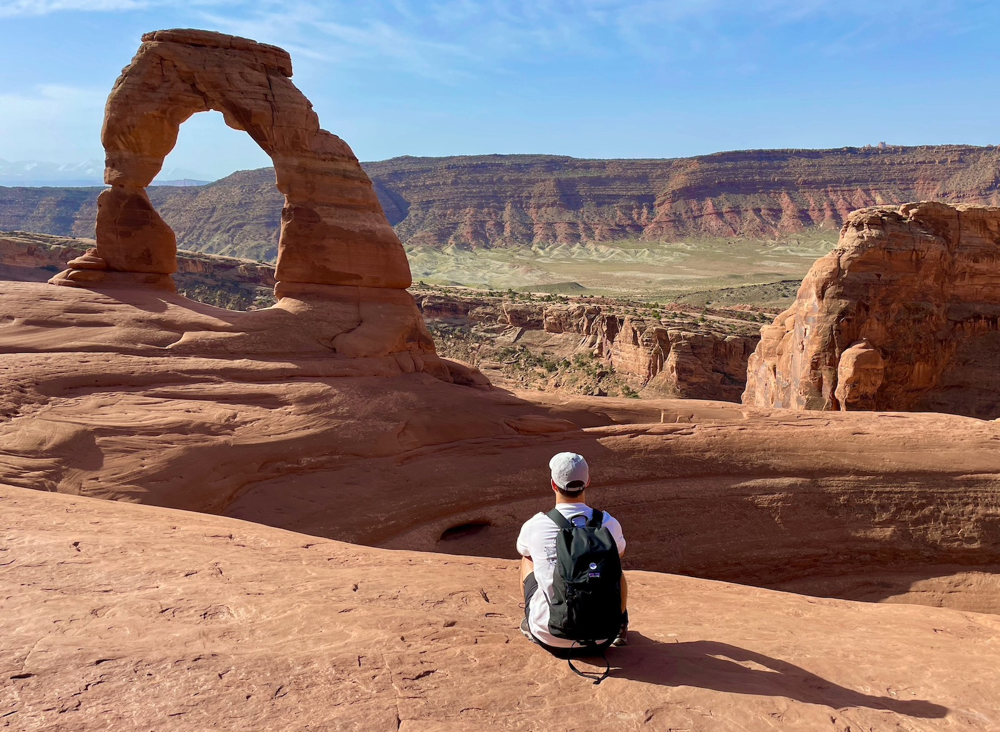

Hello, I’m Mike. 👋
===

I’m an iOS engineer and UX designer from the UK. 

I specialise in mobile design and development using Swift and UIKit. I also have extensive experience working with RxSwift, WatchOS, Objective-C, SwiftUI, Firebase, React, Javascript, TypeScript, HTML & CSS. 

### Hello world

In 2015, I quit my social media job and flew out to Salt Lake City, Utah, to attend [DevMountain](https://devmountain.com/), an industry-leading code school set in the heart of the Wasatch Mountains. Over a three month period of non-stop coding, I learnt iOS development from the ground up and started my journey into iOS app development. 💻📲

### My coding career

Since completing DevMountain I've shipped multiple 4.5+ star rated [iOS apps](https://apps.apple.com/gb/developer/michael-gilroy/id1064238651), have been [featured by Apple](https://apps.apple.com/gb/story/id1470367133) as app of the day in the App Store and have contributed towards a variety of other apps as a full-time iOS developer including [WorldRemit](https://apps.apple.com/gb/app/worldremit-money-transfer/id875855935), [Deliveroo](https://apps.apple.com/gb/app/deliveroo-food-delivery/id1001501844) and [Airtasker](https://apps.apple.com/gb/app/airtasker/id512137061) 👨‍💻

### A bit more about me

I’m a certified sailboat skipper, dog lover and movie buff. When not coding I enjoy travelling, hiking and seeking out the best local pubs.

[LinkedIn](https://www.linkedin.com/in/mikegilroy1/) |
[Twitter](https://www.twitter.com/mike_gilroy)

### Projects I'm working on

🐶 DogCam - Dog Selfie Camera (iOS/WatchOS)
[App Store](https://apps.apple.com/us/app/dogcam-dog-selfie-camera/id1441245944?platform=iphone) | [Website](https://www.dogcam.app) | [Apple App of the Day](https://apps.apple.com/gb/story/id1470367133)
